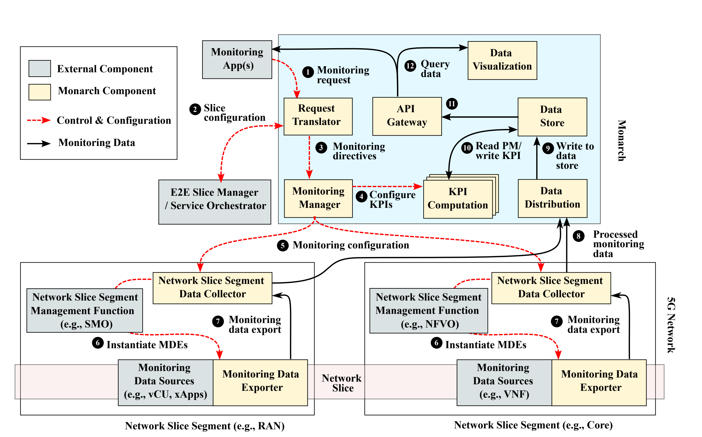
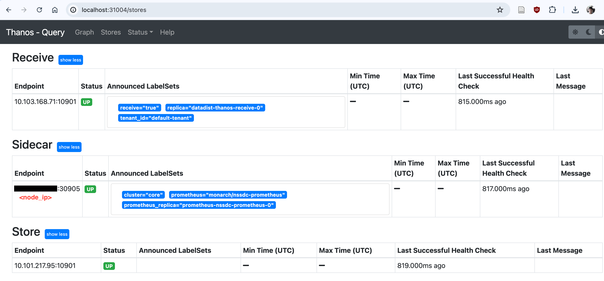
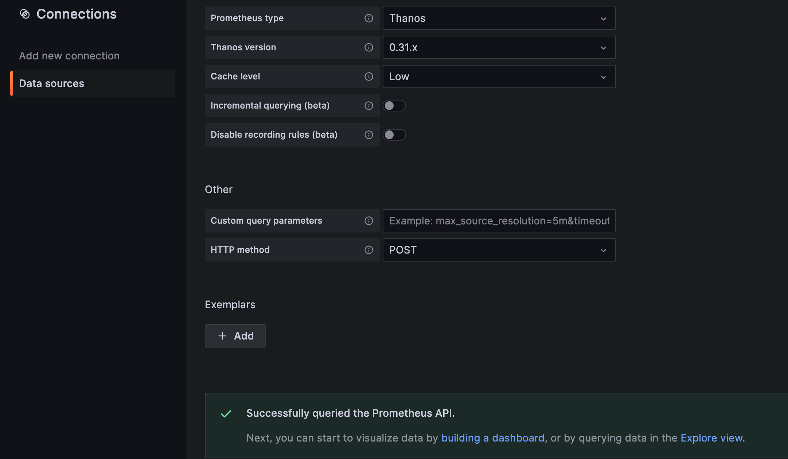

# 5G-Monarch

 

**5G-Monarch** is a network slice monitoring architecture for cloud native 5G network deployments. This repository contains the source code and configuration files for setting up 5G-MonArch, in conjunction with a 5G network deployment.



The figure above shows the conceptual architecture of Monarch. Monarch is designed for cloud-native 5G deployments and focuses on network slice monitoring and per-slice KPI computation.

## Downloads
- [NOMS'23 Paper](https://niloysaha.me/papers/conferences/2023-noms-monarch.pdf)
- [TNSM'24 Paper](https://niloysh.github.io/papers/journals/2024-tnsm-monarch.pdf)
- [KPI Monitoring Video](https://www.youtube.com/watch?v=pIMBCwPs0wc)

## Table of Contents
- [5G-Monarch](#5g-monarch)
  - [Downloads](#downloads)
  - [Table of Contents](#table-of-contents)
- [Requirements](#requirements)
  - [Hardware](#hardware)
  - [5G network](#5g-network)
    - [Step 1: Deploy a 5G Network with Network Slicing Support](#step-1-deploy-a-5g-network-with-network-slicing-support)
    - [Step 2: Verify Network Slice Deployment](#step-2-verify-network-slice-deployment)
- [Deployment](#deployment)
    - [Step 1: Create a namespace for deploying Monarch](#step-1-create-a-namespace-for-deploying-monarch)
    - [Step 2: Deploy the Data Store](#step-2-deploy-the-data-store)
      - [1. Deploy the Data Store Component](#1-deploy-the-data-store-component)
      - [2. Set Up MinIO Access](#2-set-up-minio-access)
      - [3.	Generate and Save Access Credentials](#3generate-and-save-access-credentials)
    - [Step 3: Deploy the NSSDC](#step-3-deploy-the-nssdc)
      - [1. Create the Environment File](#1-create-the-environment-file)
      - [2. Populate the Environment Variables](#2-populate-the-environment-variables)
      - [3. Deploy the NSSDC](#3-deploy-the-nssdc)
    - [Step 4: Deploy the Data Distribution Component](#step-4-deploy-the-data-distribution-component)
      - [1. Update Environment Variables](#1-update-environment-variables)
      - [2. Deploy the Data Distribution Component](#2-deploy-the-data-distribution-component)
      - [3. Verify the Deployment](#3-verify-the-deployment)
    - [Step 5: Deploy the Data Visualization Component](#step-5-deploy-the-data-visualization-component)
      - [1. Deploy the Component](#1-deploy-the-component)
      - [2. Access the Grafana GUI](#2-access-the-grafana-gui)
    - [Step 6: Deploy Monarch External Components](#step-6-deploy-monarch-external-components)
      - [1. Install Required Python Packages](#1-install-required-python-packages)
      - [2. Deploy Service Orchestrator](#2-deploy-service-orchestrator)
      - [3. Deploy NFV Orchestrator](#3-deploy-nfv-orchestrator)
    - [Step 7: Deploy the Monitoring Manager](#step-7-deploy-the-monitoring-manager)
      - [1. Update Environment Variables](#1-update-environment-variables-1)
      - [2. Deploy the Monitoring Manager](#2-deploy-the-monitoring-manager)
    - [Step 8: Deploy the Request Translator](#step-8-deploy-the-request-translator)
      - [1. Update Environment Variables](#1-update-environment-variables-2)
      - [2. Deploy the Request Translator component](#2-deploy-the-request-translator-component)
    - [Step 9: Configure Datasources and Dashboards in Grafana](#step-9-configure-datasources-and-dashboards-in-grafana)
      - [1. Add the Monarch Data Distribution (Thanos) Datasource](#1-add-the-monarch-data-distribution-thanos-datasource)
      - [2. Import a Pre-Configured Dashboard](#2-import-a-pre-configured-dashboard)
    - [Step 10: Submit a Slice Monitoring Request](#step-10-submit-a-slice-monitoring-request)
      - [1. Update Environment Variable](#1-update-environment-variable)
      - [2. Submit a slice monitoring request](#2-submit-a-slice-monitoring-request)
      - [Listing submitted requests](#listing-submitted-requests)
      - [Deleting submitted requests](#deleting-submitted-requests)
    - [Step 11: Generate Traffic and View KPIs in Grafana](#step-11-generate-traffic-and-view-kpis-in-grafana)
  - [Visualizing network slices KPIs using Monarch](#visualizing-network-slices-kpis-using-monarch)
  - [Citation](#citation)
  - [Contributions](#contributions)

# Requirements

## Hardware
- Supported OS: **Ubuntu 22.04 LTS** (recommended) or Ubuntu 20.04 LTS
- Minimum Specifications: **8 cores, 8 GB RAM**


## 5G network


### Step 1: Deploy a 5G Network with Network Slicing Support

The [open5gs-k8s](https://github.com/niloysh/open5gs-k8s) repository contains the source code and configuration files for deploying a 5G network using Open5GS on Kubernetes. Please follow the detailed instructions in the open5gs-k8s repository to set up your 5G network.

> [!NOTE]
> To enable metrics collection for monitoring purposes, select the [Deployment with Monarch](https://github.com/niloysh/open5gs-k8s?tab=readme-ov-file#2-deployment-with-monarch-for-monitoring) option while deploying open5gs-k8s.

### Step 2: Verify Network Slice Deployment

After deploying the 5G network, ensure that two network slices have been successfully configured by performing a [ping test to verify connectivity](https://github.com/niloysh/open5gs-k8s?tab=readme-ov-file#step-5-test-connectivity). This step confirms that the network is functioning correctly and is ready for Monarch deployment.

# Deployment

After completing the deployment of the 5G network, to deploy Monarch, follow the deployment steps below:

### Step 1: Create a namespace for deploying Monarch
We will create a namespace for deploying all Monarch components.

```bash
kubectl create namespace monarch
```
You can verify the creation of namespace as follows.
```bash
kubectl get namespaces
```

### Step 2: Deploy the Data Store
The `data_store` component in Monarch is an abstraction of long-term persistent storage and is responsible for storing monitoring data as well as configuration data (e.g., templates for KPI computation modules).

Follow the steps below to deploy it.

#### 1. Deploy the Data Store Component
Most Monarch components come with `install.sh` and `uninstall.sh` scripts for easy setup and teardown. To deploy the `data_store` component, navigate to its directory and run the install.sh script:

```bash
cd data_store
./install.sh
```

Verify the deployment with:
```bash
kubectl get pods -n monarch
```

You should see output similar to the following:
```bash
NAME                               READY   STATUS    RESTARTS   AGE
datastore-minio-695cb778d5-tjw44   1/1     Running   0          54s
datastore-mongodb-0                1/1     Running   0          43s
```

#### 2. Set Up MinIO Access
Monarch's data store includes a [MinIO](https://min.io/) object storage service, which requires an access key and secret key for secure access. To configure these credentials:

- Open the MinIO GUI in your browser at http://localhost:30713.
- Log in using the default credentials:
  - Username: **admin**
  - Password: **monarch-operator**

#### 3.	Generate and Save Access Credentials

After logging in, create the access key and secret key as follows:

- In the left sidebar, navigate to **Access Keys**.
- Click **Create** to generate a new access key and secret key.

You should see the credentials generated and displayed as shown below:


> [!NOTE]
> Be sure to note down these credentials, as you will need them in the next configuration steps.


### Step 3: Deploy the NSSDC

The third step is the deployment of the Network Slice Segment Data Collector (NSSDC) component. 

This component is instantiated per network slice segment (NSS) and interacts with the NSS management function (NSSMF) (e.g., service management
and orchestration (SMO) in the RAN and network function virtualization orchestration (NFVO) in the core) to instantiate monitoring data exporters (MDEs) specific to that network slice segment.

Our NSSDC uses [Prometheus](https://prometheus.io/) which is an open-source systems monitoring toolkit.

#### 1. Create the Environment File

Begin by creating a `.env` file in the root of your repository to store important environment variables, such as the Minio access key and secret key:

```bash
~/5g-monarch$ touch .env
```

#### 2. Populate the Environment Variables

Open the .env file in a text editor and add the following environment variables. Make sure to replace `<node_ip>` with the actual IP address of your Kubernetes host.

```bash
MONARCH_MINIO_ENDPOINT="<node_ip>:30712"  # Replace with the node IP of the Kubernetes host
MONARCH_MINIO_ACCESS_KEY=""  # Access key from Minio GUI
MONARCH_MINIO_SECRET_KEY=""  # Secret key from Minio GUI
MONARCH_MONITORING_INTERVAL="1s"
```

#### 3. Deploy the NSSDC

Navigate to the `nssdc` directory and execute the `install.sh` script to deploy the NSSDC:
```bash
cd nssdc
./install.sh
```

Monitor the status of the `prometheus-nssdc-prometheus-0` pod to ensure it is running correctly. Once the pod status shows READY (3/3), you can proceed to the next step:

```bash
kubectl get pods -n monarch
```
You should see output similar to the following:

```bash
NAME                               READY   STATUS    RESTARTS   AGE
datastore-minio-695cb778d5-tjw44   1/1     Running   0          21m
datastore-mongodb-0                1/1     Running   0          20m
nssdc-operator-5555d675fd-g29lv    1/1     Running   0          92s
prometheus-nssdc-prometheus-0      3/3     Running   0          91s
```

> [!NOTE]
> If the `prometheus-nssdc-prometheus-0` pod is crashing, it may indicate an issue with the IP address specified in the .env file. Ensure that you are using the correct IP address for the primary network interface (e.g., enp0s3) if you are running on a VM.

### Step 4: Deploy the Data Distribution Component

In this step, we will deploy the data distribution component. The data distribution component is responsible for collecting processed monitoring data from different NSSDCs.

Our data distribution component uses [Thanos](https://thanos.io/), which extends Prometheus with high-availability and long-term storage.

Follow the instructions below to deploy this component.

#### 1. Update Environment Variables

First, populate the following environment variables in your .env file, replacing `<node_ip>` with the actual IP address of your Kubernetes host:

```bash
MONARCH_THANOS_STORE_GRPC="<node_ip>:30905"
MONARCH_THANOS_STORE_HTTP="<node_ip>:30906"
```
> [!TIP]
> These ports are specified in the [nssdc/values.yaml](nssdc/values.yaml) file.

#### 2. Deploy the Data Distribution Component

Next, navigate to the `data_distribution` directory and run the `install.sh` script to deploy the component:
```bash
cd data_distribution
./install.sh
```
#### 3. Verify the Deployment
Verify the deployment with
```bash
kubectl get pods -n monarch
```
You should see 4 `datadist` pods deployed.
```bash
NAME                                              READY   STATUS    RESTARTS   AGE
datadist-thanos-query-689589fcf4-g5lf9            1/1     Running   0          89s
datadist-thanos-query-frontend-65cb6b64df-58hd2   1/1     Running   0          89s
datadist-thanos-receive-0                         1/1     Running   0          89s
datadist-thanos-storegateway-0                    1/1     Running   0          89s
```
> [!NOTE]
> It may take some time for these pods to reach the READY state.

Once the pods are confirmed as running, you can access the Thanos GUI at http://localhost:31004. From there, verify and that the nssdc sidecar has been successfully discovered, as shown in the figure below.



### Step 5: Deploy the Data Visualization Component

In this step, we will deploy the `data_visualization` component, which leverages  
[Grafana](https://grafana.com/).

#### 1. Deploy the Component

To deploy the data visualization component, navigate to the `data_visualization` directory and run the `install.sh` script:
```bash
cd data_visualization
./install.sh
```

Verify the deployment:
```bash
kubectl get pods -n monarch
```
You should see the `dataviz-grafana` pod in READY(2/2) state after some time.
```bash
dataviz-grafana-747d778c9c-xkhhv     2/2     Running   0          45s
```

#### 2. Access the Grafana GUI

Once the data_visualization component has been successfully deployed, you can access the Grafana GUI at at http://localhost:32005. Login with the default credentials:
- Username: **admin**
- Password: **prom-operator**

### Step 6: Deploy Monarch External Components

To deploy Monarch's external components, follow the steps below. These components are required for the [request_translator](request_translator) and [monitoring_manager](monitoring_manager) modules to function correctly.

#### 1. Install Required Python Packages
Several components depend on Python libraries like flask and requests. Install these dependencies by running:

```bash
pip3 install -r requirements.txt
```

#### 2. Deploy Service Orchestrator
The Service Orchestrator is a mock component that simulates the basic functionality of the actual service orchestrator (e.g., [ONAP](https://www.onap.org/)). 
To deploy the Service Orchestrator, run:

```bash
cd service_orchestrator
./install.sh
```
You can verify that it is running with:
```bash
kubectl get pods -n monarch | grep service-orchestrator
```
Expected output:
```bash
service-orchestrator-7b9ffd8c5b-5twq7             1/1     Running   0              2m50s
```
Once it is running, you can check the logs:
```bash
kubectl logs service-orchestrator-7b9ffd8c5b-5twq7 -n monarch
```
You should see an output similar to the following, indicating successful startup:
```bash
2024-11-01 12:03:14,409 - service_orchestrator - INFO - Service Orchestrator started
2024-11-01 12:03:14,410 - service_orchestrator - INFO - Slice info loaded: {'1-000001': [{'nf': 'upf1', 'nss': 'edge'}, {'nf': 'smf1', 'nss': 'core'}], '2-000002': [{'nf': 'upf2', 'nss': 'edge'}, {'nf': 'smf2', 'nss': 'core'}]}
```


**Verify the Service orchestrator Health**

Open a new terminal and verify that the Service Orchestrator is running correctly by executing the following test script:
```bash
./service_orchestrator/test-orchestrator.sh 
```

A successful response will resemble:
```bash
{
  "message": "Service Orchestrator is healthy",
  "status": "success"
}
{
  "pods": [
    {
      "name": "open5gs-smf1-6d8bcc6789-tkmbm",
      "nf": "smf",
      "nss": "edge",
      "pod_ip": "10.244.0.105"
    },
```
#### 3. Deploy NFV Orchestrator
Next, deploy the NFV Orchestrator, another mock component that simulates NFV orchestration functionalities. This should remain running in the background to ensure continuous communication with Monarch components. We recommend leaving it running in a separate terminal. 
Run it with the command:
```bash
cd nfv_orchestrator
python3 run.py
```

> [!WARNING]
> Keep the nfv orchestrator running in this terminal, as it will be essential for interactions with the monitoring_manager and other Monarch modules! 

### Step 7: Deploy the Monitoring Manager

Step 7 is deploying the [monitoring_manager](monitoring_manager) component. 

#### 1. Update Environment Variables

First, add the following environment variable to your `.env` file, replacing `<node_ip>` with the actual IP address:

```bash
NFV_ORCHESTRATOR_URI="http://<node_ip>:6001"
```
> [!NOTE]
> Make sure that the NFV orchestrator is running at the specified URI.
> We can check this as follows:
> ```bash
> curl -X GET http://localhost:6001/api/health
> ```
> You should see the following:
> ```bash
> {
>  "message": "NFV Orchestrator is healthy",
>  "status": "success"
> }
>```

#### 2. Deploy the Monitoring Manager
Navigate to the `monitoring_manager` directory and run the `install.sh` script to deploy the component:
```bash
cd monitoring_manager
./install.sh
```


### Step 8: Deploy the Request Translator

Next, we  will deploy the [request_translator](request_translator) component. 

#### 1. Update Environment Variables

Add the following environment variable to your .env file, replacing <node_ip> with the actual IP address:
```bash
SERVICE_ORCHESTRATOR_URI="http://<node_ip>:30501"
```
#### 2. Deploy the Request Translator component
Navigate to the `request_translator` directory and run the `install.sh` script:
```bash
cd request_translator
./install.sh
```

### Step 9: Configure Datasources and Dashboards in Grafana

In this step, we’ll configure datasources and add dashboards in Grafana, using the Grafana GUI from Step 5.

#### 1. Add the Monarch Data Distribution (Thanos) Datasource

1. In Grafana, navigate to **Home > Connections > Data Sources** and select **Add new data source**.
2. Configure the datasource by filling in the following fields:

First, we need to add the Monarch datadist (Thanos) datasource. Click on Home->Connections->Data Sources->Add new data source. Populate the following fields: 

- Name: **monarch-thanos**
- Prometheus server URL: **http://<node_ip>:31004**
- Promtheus type: **Thanos**
- Thanos version: **0.31.x**
- HTTP method: **POST**




#### 2. Import a Pre-Configured Dashboard
To import a pre-configured dashboard for monitoring two network slices:

1.	Go to **Home > Dashboards > New > Import**.
2.	Select the `monarch-dashboard.json` file located at [dashboards](dashboards) and follow the prompts to complete the import.

### Step 10: Submit a Slice Monitoring Request

In this step, you’ll submit a slice monitoring request to the request_translator component. Upon successful submission, the Monitoring Data Exporters (MDEs) and KPI computation processes will be triggered, and the results will appear on the Grafana dashboard.

#### 1. Update Environment Variable

First, update the environment variable in the `.env` file with the appropriate IP for the Monarch Thanos URL:
```bash
MONARCH_THANOS_URL="http://<node_ip>:31004"
```

#### 2. Submit a slice monitoring request

To submit a slice monitoring request, we can use the `test_api.py` script in the `request_translator` directory. 

```bash
cd request_translator
python3 test_api.py --url "http://localhost:30700" --json_file requests/request_slice.json submit
```

Expected output:
```
Status Code: 200
Response: {'request_id': 'HqYQa4ZMSZaS5PGYVntAJZ', 'status': 'success'}
```

> [!TIP]
> Note the request_id for future reference. You can use later to delete the request.


Upon submission, you should see the creation of metrics services for the AMF, SMF, and UPF network functions:

```bash
kubectl get service -n open5gs | grep metrics
```
Example output:

```bash
amf-metrics-service   ClusterIP   10.105.19.40     <none>        9090/TCP                                     8m34s
smf-metrics-service   ClusterIP   None             <none>        9090/TCP                                     8m34s
upf-metrics-service   ClusterIP   None             <none>        9090/TCP                                     8m34s
```
You should also see the KPI computation component running:

```bash
kubectl get pods -n monarch | grep kpi
```
Example output:
```bash
kpi-calculator-fc599b544-pqd5b                    1/1     Running   0          9m49s
```

#### Listing submitted requests

To list all submitted requests, run:

```bash
cd request_translator
python3 test_api.py --url "http://localhost:30700" list
```
Example output:
```bash
Status Code: 200
Response: {'data': {'HqYQa4ZMSZaS5PGYVntAJZ': {'api_version': '1.0', 'duration': {'end_time': '2023-12-01T00:05:00Z', 'start_time': '2023-12-01T00:00:00Z'}, 'kpi': {'kpi_description': 'Throughput of the network slice', 'kpi_name': 'slice_throughput', 'sub_counter': {'sub_counter_ids': ['1-000001', '2-000002'], 'sub_counter_type': 'SNSSAI'}, 'units': 'Mbps'}, 'monitoring_interval': {'adaptive': True, 'interval_seconds': 1}, 'request_description': 'Monitoring request for slice throughput', 'scope': {'scope_id': 'NSI01', 'scope_type': 'slice'}}, 'KvaF952C4vsNKQf4Aywc4o': {'api_version': '1.0', 'duration': {'end_time': '2023-12-01T00:05:00Z', 'start_time': '2023-12-01T00:00:00Z'}, 'kpi': {'kpi_description': 'Throughput of the network slice', 'kpi_name': 'slice_throughput', 'sub_counter': {'sub_counter_ids': ['1-000001', '2-000002'], 'sub_counter_type': 'SNSSAI'}, 'units': 'Mbps'}, 'monitoring_interval': {'adaptive': True, 'interval_seconds': 1}, 'request_description': 'Monitoring request for slice throughput', 'scope': {'scope_id': 'NSI01', 'scope_type': 'slice'}}, 'TDpUDNjAh5XSwPbmKNBaQZ': {'api_version': '1.0', 'duration': {'end_time': '2023-12-01T00:05:00Z', 'start_time': '2023-12-01T00:00:00Z'}, 'kpi': {'kpi_description': 'Throughput of the network slice', 'kpi_name': 'slice_throughput', 'sub_counter': {'sub_counter_ids': ['1-000001', '2-000002'], 'sub_counter_type': 'SNSSAI'}, 'units': 'Mbps'}, 'monitoring_interval': {'adaptive': True, 'interval_seconds': 1}, 'request_description': 'Monitoring request for slice throughput', 'scope': {'scope_id': 'NSI01', 'scope_type': 'slice'}}, 'hLHJDHjkEE7dBydukLVCyJ': {'api_version': '1.0', 'duration': {'end_time': '2023-12-01T00:05:00Z', 'start_time': '2023-12-01T00:00:00Z'}, 'kpi': {'kpi_description': 'Throughput of the network slice', 'kpi_name': 'slice_throughput', 'sub_counter': {'sub_counter_ids': ['1-000001', '2-000002'], 'sub_counter_type': 'SNSSAI'}, 'units': 'Mbps'}, 'monitoring_interval': {'adaptive': True, 'interval_seconds': 1}, 'request_description': 'Monitoring request for slice throughput', 'scope': {'scope_id': 'NSI01', 'scope_type': 'slice'}}}, 'status': 'success'}
```

#### Deleting submitted requests

To delete a specific request by `request_id`:


```bash
cd request_translator
python3 test_api.py --url "http://localhost:30700" delete --request_id <request_id>
```
Expected output:
```bash
Status Code: 200
Response: {'message': 'Monitoring request deleted', 'status': 'success'}
```

At this point, all Monarch components are set up and ready for use.

### Step 11: Generate Traffic and View KPIs in Grafana
To start monitoring KPIs in real-time, generate traffic through the UEs. Once the traffic flows through, you'll see computed KPIs for the network slices in the Grafana dashboard configured earlier.
. 

> [!NOTE]
> For testing, you can use the `uesimtun0` interface for the UEs to send ping traffic through the network slices, as shown in [conduct a ping test](https://github.com/niloysh/open5gs-k8s?tab=readme-ov-file#step-4-conduct-a-ping-test).

## Visualizing network slices KPIs using Monarch

The dashboard below shows Monarch being used to monitor network slices for a cloud-gaming use-case during a [demo at the University of Waterloo](https://uwaterloo.ca/news/researching-cutting-edge-5g-network-slicing-technology). 


## Citation


If you use the code in this repository in your research work or project, please consider citing the following publication.

> N. Saha, N. Shahriar, R. Boutaba and A. Saleh. (2023). MonArch: Network Slice Monitoring Architecture for Cloud Native 5G Deployments. In Proceedings of the IEEE/IFIP Network Operations and Management Symposium (NOMS). Miami, Florida, USA, 08 - 12 May, 2023.


## Contributions
Contributions, improvements to documentation,  and bug-fixes are always welcome!
See [first-contributions](https://github.com/firstcontributions/first-contributions).


