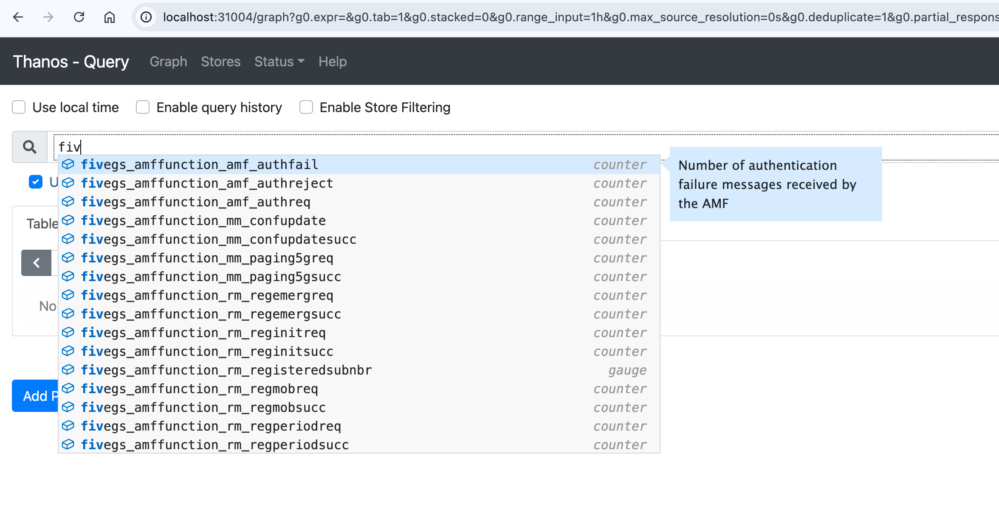

# Lab 1: Using Thanos Query to access 5G network metrics

In this lab, you will use the Thanos Query API to retrieve and analyze key 5G metrics. Thanos Query is a powerful tool that aggregates and queries metrics from different NSSDC (Prometheus) instances (e.g., edge, core, RAN), providing insights into network performance, subscriber statistics, and more.

### Lab Objectives

- Learn to navigate and use the Thanos Query API for 5G metrics.
- Query metrics related to registered subscribers and session IDs.
- Cross-reference metrics with data in Grafana.

## Getting Started

### 1. Access the Thanos Query API
- Open your browser and navigate to the Thanos Query API at http://localhost:31004/.

- The interface provides autocomplete suggestions (as shown above), which can help you find and complete metric names. Each metric also includes a brief description for clarity.

### 2. Familiarize Yourself with the Interface

- Take a moment to explore the available metrics. Notice that the autocomplete suggestions show descriptions for each metric, which can help you understand what each metric tracks.

> [!TIP]
>  Look for keywords like 5g, smf, subscriber, or session to quickly find relevant metrics for this lab.

## Task 1: Retrieve the Number of Registered Subscribers

- Use the autocomplete to search for the metric `fivegs_amffunction_rm_registeredsubnbr`. This metric tracks the number of registered subscribers in each slice.

- Note the output. How many registered subscribers are there in each slice? 

### Task 2: Task 2: Retrieve Session IDs for Each Slice

- To locate session information, look at metrics from the Session Management Function (SMF). The SMF manages session IDs, which are essential for tracking connections across slices.
- Search for SMF-related metrics in the Thanos Query API. Look for metrics that include terms like session, id, or slice.
- Query the metric that shows session IDs and note down the session IDs associated with each slice. Compare these session IDs with those displayed in the Grafana dashboard. Do they match?
