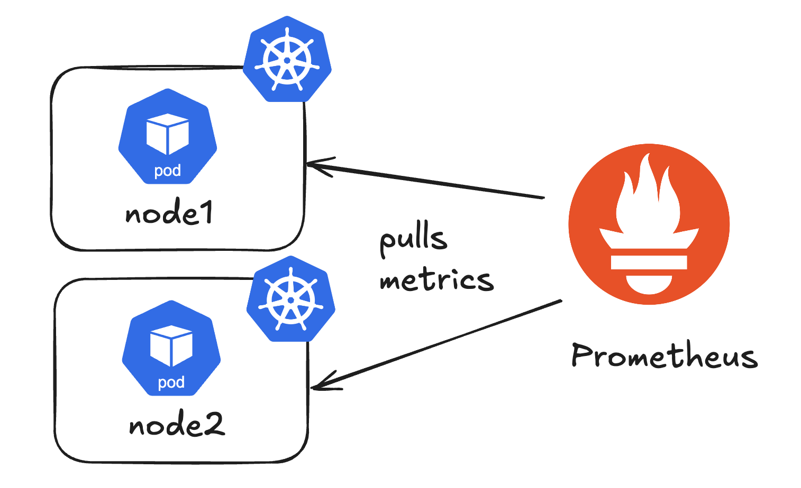
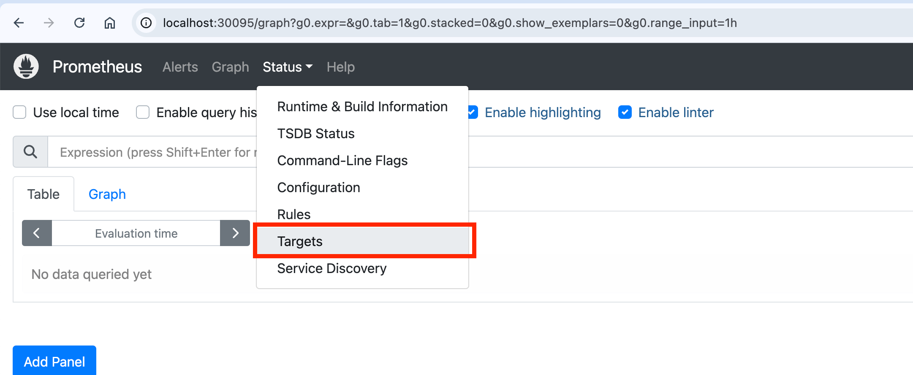
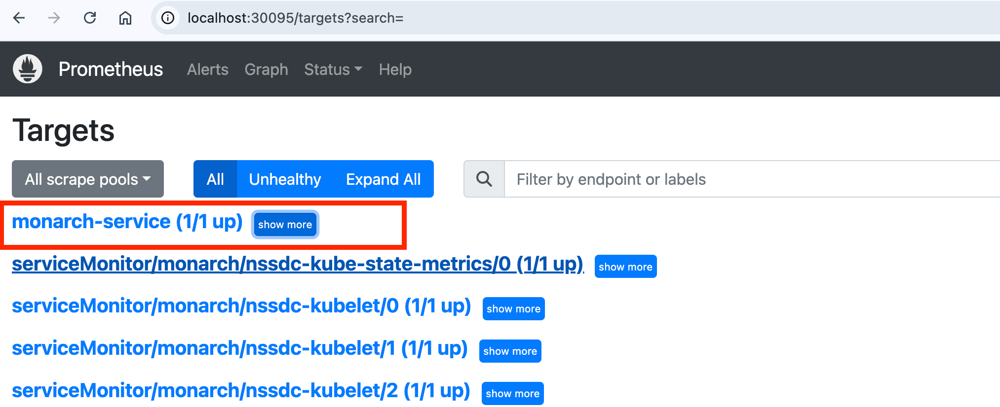
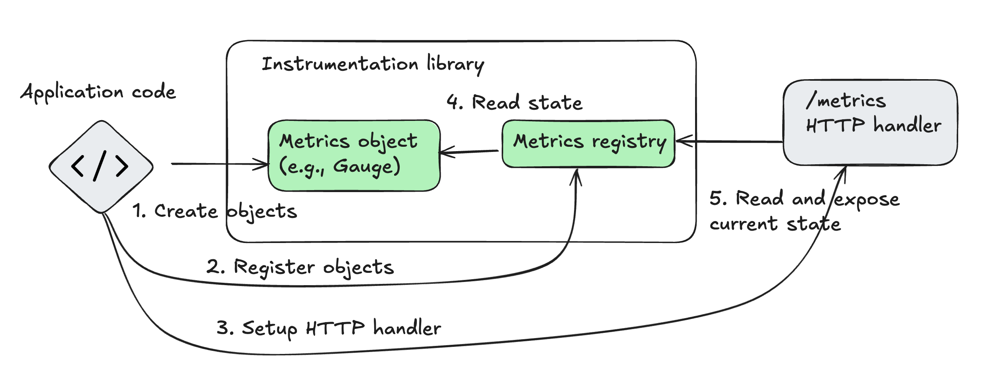

# Lab 1: Prometheus Fundamentals
Monarch NSSDC is powered by Prometheus for monitoring and data collection.

In this lab, you will learn essential Prometheus concepts, including:

- **Introduction to Prometheus** – What it is and how it works
- **Instrumentation** – How to expose application data to Prometheus
- **Service Discovery** – How to automatically track your exposed metrics

---
# What is Prometheus?

Prometheus is a metrics-based monitoring toolkit that provides libraries and components for:
- Tracking and exposing metrics
- Collecting metrics
- Storing metrics
- Querying metrics




---
# Accessing Prometheus

Use `kubectl get pods -n monarch` to verify our Prometheus deployment as `Running`.

```bash
prometheus-nssdc-prometheus-0       3/3     Running   0          36m
```

You can access Prometheus GUI at [http://localhost:30095/](http://localhost:30095/)


---
# Prometheus Targets

In Prometheus, a **target** is a resource or endpoint that provides metrics for collection.



---
# What are the Targets for Monarch?


- **Target**: `monarch-service (1/1 up)` – tracks metrics from Monitoring Data Exporters (MDEs).
- **Status Indicator**: The number (1/1 up) shows how many services are discovered and actively monitored. For instance, if all MDEs are running, you’ll see (4/4 up).

---
# Service Discovery (1/2)

Prometheus uses dynamic service discovery, eliminating the need for manual configuration of each service, device, pod, or container.

- **Flexible Discovery Options**: Prometheus supports various discovery mechanisms, including file-based and HTTP methods.
- **Kubernetes Integration**: In Monarch, we leverage Kubernetes service discovery to automatically detect and monitor dynamic endpoints, such as pods, containers, and services.

---
# Service Discovery (1/2)

The following snippet from `nssdc/values.yaml` shows how we configure Prometheus to automatically discover services in the `open5gs` and `monarch` namespaces:


```yaml
additionalScrapeConfigs:
    - job_name: "monarch-service"
    scrape_interval: 1s
    kubernetes_sd_configs:
        - role: service
        namespaces:
            names:
            - 'open5gs'
            - 'monarch'
```
---
# Instrumenting Applications with Prometheus SDK
Prometheus offers SDKs in various languages (e.g., Python, C, Java) to enable applications to expose metrics for monitoring.

In this lab, we’ll use the **Python SDK** to instrument a sample application.

**1. Navigate to the `lab1` directory:**
```
cd labs/lab1
```
**2. Inspect the Instrumented Code:**
- Open `app/exporter.py` to see a Python application generating simulated metrics for this workshop.
- The app is instrumented with the Prometheus Python SDK to expose metrics.

---
# Prometheus SDK 



---
# Sample application with Prometheus SDK (1/2)

**1. Importing Prometheus Libraries**

```python
from prometheus_client import start_http_server, Gauge
```
- `start_http_server`: Starts a local HTTP server to expose metrics so Prometheus can scrape them.
- `Gauge`: A metric type in Prometheus for tracking values that can go up and down, like response times or temperatures.

**2. Defining a Custom Metric**

```python
RESPONSE_TIME = Gauge('workshop_response_time_seconds', 
'Response time in seconds', ['service', 'region'])
```
- We create a gauge metric named `workshop_response_time_seconds`.
- We add service and region **labels** to specify the origin of each metric instance.

---
# Sample application with Prometheus SDK (2/2)

**3. Setting Metric Values**

```python
RESPONSE_TIME.labels(service=service, region=region)
.set(metric_values[(service, region)])
```
- **Labels**: The labels method assigns values to the metric’s service and region labels.
- **Set Value**: `set()` updates the gauge with the latest response time value for that specific service and region.

**4. Starting the Metric Server**

```python
start_http_server(8000)
```
Launches an HTTP server on port 8000, allowing Prometheus to scrape exposed metrics from this application.

---
# Deploying our Sample Application
The `deployment.yaml` file shown below deploys `prom-exporter` which contains our sample application instrumented with Prometheus SDK.

```yaml
apiVersion: apps/v1
kind: Deployment
metadata:
  name: prom-exporter
...
```
```
kubectl apply -f deployment.yaml
```

Once running, open a shell using:
```bash
kubectl exec -it deployments/prom-exporter -n monarch -- /bin/bash
```
---
# Checking Metrics
Since our pod is exposing metrics on port 8000, we can check that using
```bash
curl http://localhost:8000
```

**Expected Output**
If you scroll to the bottom, you should see our instrumented metrics:
```bash
# HELP workshop_response_time_seconds Response time in seconds
# TYPE workshop_response_time_seconds gauge
workshop_response_time_seconds{region="us-west",service="auth_service"} 0.3252940783542173
workshop_response_time_seconds{region="us-east",service="auth_service"} 0.8983759103853045
workshop_response_time_seconds{region="us-west",service="payment_service"} 0.9844379249303663
workshop_response_time_seconds{region="us-east",service="payment_service"} 0.9593282198671773
```

Next, let's look at how to deploy a service so that these metrics will be automatically discovered by Prometheus using Kubernetes service discovery.

---
# Deploy Service for Metric Discovery

The `service.yaml` file shown below shows how we can deploy a service with some annotations that help Prometheus in discovering this service.

```yaml
metadata:
  name: prom-exporter-service
  annotations:
    prometheus.io/scrape: "true"
    prometheus.io.scheme: "http"
    prometheus.io/path: "/metrics"
    prometheus.io/port: "8000"  # which port should Prometheus scrape
```
Once deployed using `kubectl apply -f service.yaml`, you should see the target show up in the Prometheus targets.


---
# Next Steps

**Congratulations!**
You've successfully completed the following:
- Learned about Prometheus and its basic capabilities.
- Deployed a sample application instrumented with the Prometheus SDK to expose metrics.
- Configured a Kubernetes service that enables Prometheus to automatically discover and scrape the target.

**What's Next?**
Continue to [Lab 2](https://niloysh.github.io/5g-monarch/labs/lab2/README.pdf) to learn the basics of querying and extracting insights from the collected metrics.
