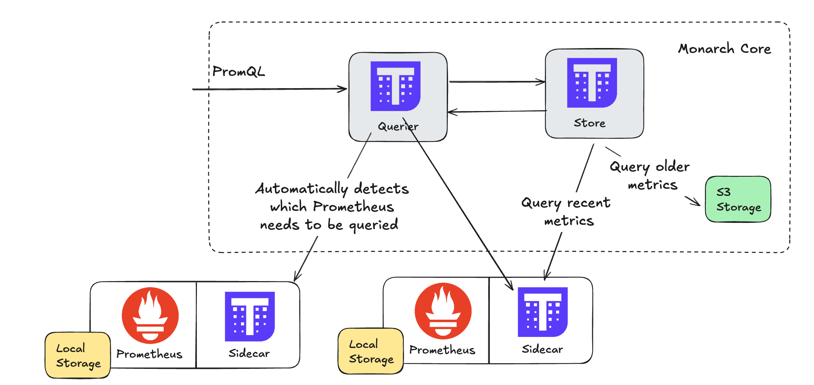

# Lab 3: Using the Thanos HTTP API with Python

In this lab, you will learn how to use Thanos's HTTP API using Python.

Using Python's HTTP requests library, you can programmatically access metrics for more flexible data manipulation and analysis. 

This approach lets you combine, filter, and analyze metrics, which is especially useful for complex metrics like resource utilization across network functions.

---

# Using the Thanos HTTP API with Python (1/3)

We can query our metrics using Thanos Querier's HTTP API.



---
# Using the Thanos HTTP API with Python (2/3)

1.	Open [exercise.py](exercise.py): This file contains a skeleton of code for **Tasks 1 through 3**.
2.	Structure of the Exercise Code:
	- `query_prometheus`: Sends a Prometheus query to the Thanos HTTP API.
	- `parse_numeric_value_from_prometheus_response`: Parses numeric results from the API response.
	- `parse_data_from_prometheus_response`: Parses return data (raw) from the API response.

---
# Using the Thanos HTTP API with Python (3/3)

### Example query in python

In exercise.py you will find the following snippet, showing an example of using the HTTP API.

```python
query = 'fivegs_amffunction_rm_registeredsubnbr'
response = query_prometheus(query)
print(response)
```

**Task**: Try running `python3 exercise.py` to see the raw JSON response from the API.

---

# Retrieve VNFM Metrics for Resource Utilization

1.	**Pod Status and Resource Utilization**: VNFM metrics can provide insights into the health of 5G network functions by monitoring the status of Kubernetes pods and resource utilization.

2.	**Query Example**: Query metrics like `kube_pod_info` and `kube_pod_container_resource_requests` to get details about the network functions' CPU and memory usage.

**Task**: Modify the code to retrieve CPU and memory usage data, then parse and display it in a readable format.

---
# Compose Slice-Level KPIs (1/2)


We've already explored examples of slice-level metrics, like `slice_throughput`, as we saw in our Grafana dashboard.

Monarch's KPI computation module leverages the Python HTTP API to query raw metrics, calculate KPIs at the slice level, and store them back in a `data_store`, making them accessible for visualization in Grafana.


**Task**: 
- Task 3 of [exercise.py](exercise.py) dives deeper into composing slice-level metrics, specifically focusing on calculating resource utilization for slice 1 (with `SNSSAI=1-000001`). 
- You'll combine multiple queries to determine memory usage, providing a practical understanding of how to build KPIs from various metric sources.

---
# Compose Slice-Level KPIs (2/2)

**Step 1: Retrieve Memory Requests**
- Query kube_pod_container_resource_requests to get memory requests for SMF1 and UPF1. Parse and store these values.

**Step 2: Retrieve Memory Usage**
- Use `avg_over_time(container_memory_working_set_bytes{pod=~".*smf1.*"}[5m])` to find the 5-minute average memory usage for SMF1. Do the same for UPF1.

**Step 3: Calculate the Percentage**
- Sum the memory requests and usage for both SMF1 and UPF1. Calculate the percentage of requested memory currently being used.

---
# Next Steps

**Congratulations!**
You've successfully completed the following:
- Learned how to use the Thanos HTTP API using Python.
- Learned how to use multiple queries to compute different 5G related KPIs.

**You have completed Day 1 of our workshop. What's Next?**


