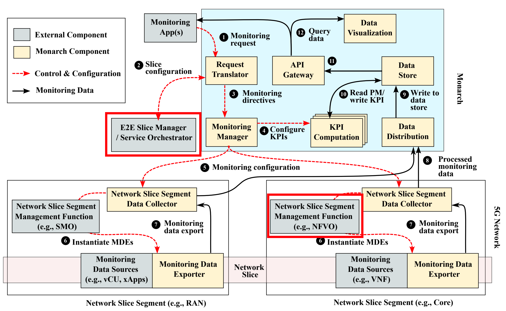
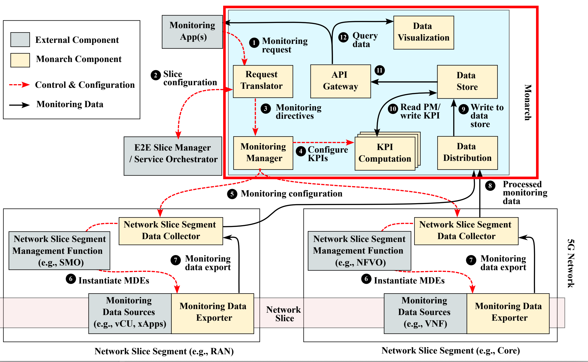
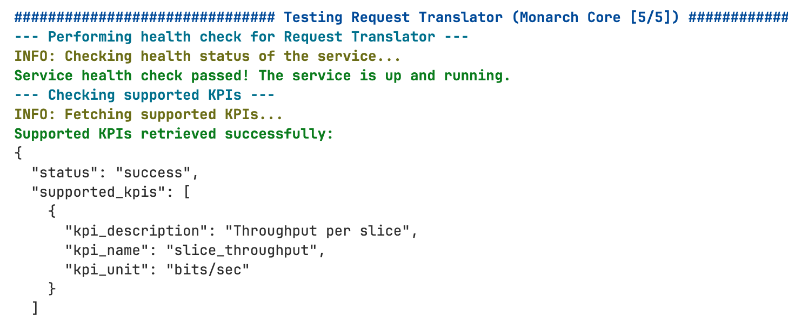
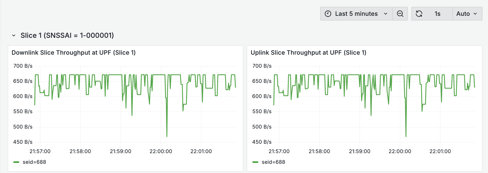
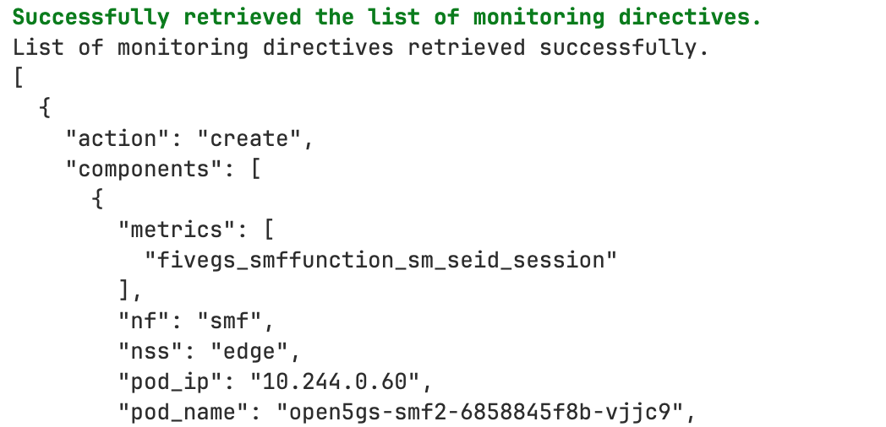

# Deploying Monarch
Deployment involves 4 primary phases:

**1. External Components:** Deploy the Service Orchestrator and NFV Orchestrator, ensuring they are prepared to manage and support Monarch’s functions.

**2. Core Monarch Components:** Set up Monarch’s core modules that handle critical processing and system coordination.

**3. Network Slice Segment (NSS) Components:** Install the NSS components across all segments for full slice coverage. For our workshop, we only have one segment.

**4. Slice Monitoring and KPI Modules:**
Submit a monitoring request to trigger the creation of Monitoring Data Exporter and KPI Computation Modules.

---
# Before Starting Deployment

**1. Navigate to the home directory**
Use the `cd` command to ensure you’re starting from your home directory.

**2. Clone the Monarch repository**
Use `git clone` to fetch the source code from the Monarch GitHub repository.
```bash
git clone https://github.com/niloysh/5g-monarch.git
cd 5g-monarch
```
**3. Set Up Environment Variables**
Monarch involves several interconnected components, so it's crucial to configure them correctly to ensure they can communicate with each other.
- Open the `.env` file in VSCode and locate the `NODE_IP` field.
- Run the `./replace-node-ip.sh` script to automatically add the correct node IP.

---
# Phase 1 - Deploying External Components

---
# External Components

<style>
img[alt~="center"] {
  display: block;
  margin: 0 auto;
}
</style>



---

# Deploying External Components


**1. Run the deployment script**
Execute the following command to set up essential external dependencies for Monarch, including the **Service Orchestrator** and **NFV Orchestrator**. 

```bash
./deploy-external.sh
```
**What this does**:
- **Service Orchestrator**: Allows Monarch to retrieve information about network functions (NFs) in each slice and the segments in which these NFs are deployed.
- **NFV Orchestrator**: Manages the deployment of network functions (NFs) and Monarch's data exporters within the network.

**Note**: In this workshop, we assume simple implementations of these components for demonstration purposes. Projects such as ONAP (Open Network Automation Platform) provide can realistic implementations for these components.

---
# Testing External Components
Once deployed, you can test the external components with the testing script.
```bash
./test-external.sh
```


---
# Phase 2 - Deploying Monarch Core Components

---
# Monarch Core Components

<style>
img[alt~="center"] {
  display: block;
  margin: 0 auto;
}
</style>



---
# Deploying Monarch Core

**1. Run the deployment script**
```bash
./deploy-monarch-core.sh
```

This script will initialize key core modules, including:
- **Request Translator and Monitoring Manager** – Deployed using Python Flask, these components handle translation of monitoring requests and management of monitoring tasks.
- **Data Store** – Configured with MongoDB for database storage and MinIO S3 for scalable object storage.
- **Data Distribution** – Uses Thanos to efficiently collect monitoring data from different network segements.
- **Data Visualization** – Leverages Grafana for comprehensive visualization of key performance indicators (KPIs) and metrics.
---
# Verifying Monarch Core Deployment
Monarch components are deployed in the `monarch` namespace.
While Monarch components are being deployed, you can use `kubectl get pods -n monarch` with the `watch` command in a **new terminal** to see the progress.

```bash
watch kubectl get pods -n monarch
```


---
# Testing Monarch Core Components
Once deployed, you can test the Monarch core components with the testing script.
```bash
./test-monarch-core.sh
```


---
# Accessing Graphical User Interfaces (GUIs)
Some Monarch components provide user-friendly GUIs, enabling you to monitor and visualize data effectively.

**Thanos (Data Distribution)**
- Access Thanos at: http://localhost:31004
- Use Thanos to explore distributed data storage and retrieve historical monitoring data. We will see how to use Thanos later in [Lab3](labs/lab3/README.md).

**Grafana (Data Visualization)**
- Access Grafana at: http://localhost:32005. Login details are: **username:** `admin` and **password:** `monarch-operator`.
- Grafana enables interactive dashboards and visualization of key performance indicators (KPIs). After submitting a monitoring request, you'll view a slice KPI monitored live in the Grafana dashboard.

---
# Phase 3 - Deploying Monarch NSS Components

---
# Deploy Monarch NSS Components
**1. Run the deployment script**
```bash
./deploy-monarch-nss.sh
```

**What this does**:
This script initializes the NSSDC (Network Slice Segment Data Collector), which is implemented using **Prometheus**.

**Prometheus** is an open-source monitoring toolkit. It collects and stores metrics as time series data, offering powerful querying capabilities and seamless integrations with tools like Grafana for visualization.

We will cover Prometheus in more detail in [Lab 1](labs/lab1/README.md) and [Lab 2](labs/lab2/README.md), where you will learn how to instrument an application to expose metrics to Prometheus and work with the Prometheus query language.

---
# Verify and Test Monarch NSS Deployment
Monitor the status of the `prometheus-nssdc-prometheus-0` pod. Wait for it to become `READY (3/3)`.

Once it is ready, you can test the Monarch NSS components with the testing script.
```bash
./test-monarch-nss.sh
```


You can access the Prometheus GUI at: [http://localhost:30095](http://localhost:30095)

---
# Phase 4 - Network Slice Monitoring

---
# Submitting a Slice Monitoring Request (1/3)
To submit a slice monitoring request, we interact with the **Request Translator** module, which processes the request and forwards it for further actions.

**1. Create the JSON Request**
The request is submitted using a JSON file, where you define the KPI for monitoring. Here's a snippet from the `request_translator/requests/request_slice.json` file:
```json
{"kpi":
{"kpi_name":"slice_throughput",
"kpi_description":"Throughput of the network slice",
"sub_counter":{"sub_counter_type":"SNSSAI",
"sub_counter_ids":["1-000001","2-000002"]}}}
```
We can submit a request as follows:
```bash
cd request_translator
python3 test_api.py --json_file requests/request_slice.json submit
```
---
# Submitting a Slice Monitoring Request (2/3)
After submitting the slice monitoring request, Monarch will initiate the creation of **Monitoring Data Exporters (MDEs)** and the **KPI computation module**.

**1. Verify MDE Creation**
Once the request is processed, three metrics services should be created, corresponding to the MDEs. You can verify their creation by running the following command:
```bash
kubectl get svc -n open5gs | grep metrics
```

**2. Check for KPI Calculator Pod**
Next, in your terminal where the `kubectl get pods -n monarch` command is running, you should observe a new pod for the KPI Calculator. This pod is responsible for calculating and processing KPIs based on the monitoring data.

---
# Submitting a Slice Monitoring Request (3/3)


**3. View Logs of the KPI Calculator**
To inspect the logs of the KPI calculator pod, use the following command:
```bash
kubectl logs kpi-calculator-<replace_id> -n monarch
```
In the logs, you should see output indicating that the slice SNSSAI is being monitored, but with a rate of **0 Mbps** (since no traffic is flowing through the slice during this phase).

**4. Send Traffic to Trigger KPI Calculations**
To observe the monitoring in action, send traffic through the slice by performing a ping test. You can do this from the **UE1** and **UE2** pods, using the `uesimtun0` interface, just like we did earlier in the core deployment session.

Once you've started the ping test, keep it running and check the KPI calculator logs again.

---
# Visualizing Slice KPI using Grafana (1/3)

**1. Access Grafana**
Open the Grafana interface (http://localhost:32005) and log in using the following credentials: **username:** `admin` and **password:** `monarch-operator`.

**2. Navigate to the Monarch Dashboard**
Once logged in, select **Dashboards** from the left sidebar. Locate and open the **Monarch Dashboard**, which has been pre-configured to display the `slice_throughput` KPI for our two slices.


---
# Visualizing Slice KPI using Grafana (2/3)



Each panel shows throughput per slice and direction (uplink/downlink). At the bottom, you'll find the **Session IDs (SEIDs)** associated with each slice.

If you deployed UE3 in our previous core deployment session, you should see two SEIDs displayed here, corresponding to multiple active sessions.

---
# Visualizing Slice KPI using Grafana (3/3)

To customize a panel, click the 3 little dots in the corner, and select the Edit option:


In the edit view, you’ll notice:
**1. Data Source** – The data source for this panel is Thanos, which aggregates and retrieves monitoring data.
**2.Metrics Query** – In the Metrics Browser section, you'll see a query written in PromQL (Prometheus Query Language). This query defines how the data is fetched and displayed on the panel.

---
# Looking Under the Hood

Now that the slice KPIs are being computed, let’s revisit the core functionality by running the `test-monarch-core.sh` script again.

This time, in the **Monitoring Manager** test output, you should see additional details related to the monitoring directives that were generated from the high-level monitoring request we submitted earlier.



---
# Next Steps
**Congratulations!**
You've successfully completed the following:
- Completed deployment of Monarch.
- Submitted a slice monitoring request.
- Visualized slice KPIs in Grafana.

**What's Next?**
Continue to [Lab 1](https://niloysh.github.io/5g-monarch/labs/lab1/README.pdf) to learn about using instrumenting applications with metrics support and querying metrics.


